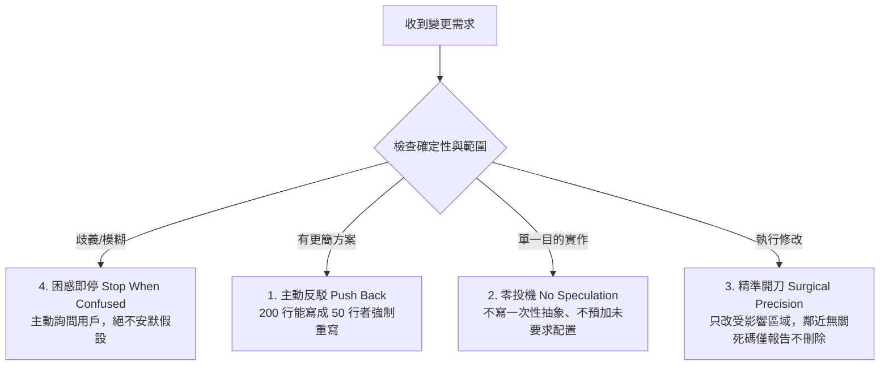
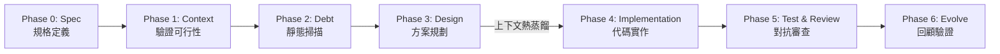

# 🚀 7-Phase Agentic Workflow (7 階段代理人開發協作架構)

> **版本**：v2.0 (Integrated Spec-Driven Development & Karpathy Behavioral Guidelines)  
> **適用環境**：Antigravity, Cursor, Claude Code, Windsurf 或同等級 Agentic IDE  
> **核心理念**：Spec-First（規格優先）、Simplicity-First（簡潔至上）、Surgical-Changes（精準開刀）、Token Economy（Token 節能）

本專案是一個專為 AI Agent 輔助開發設計的現代化全流程協作架構。深度整合 **Spec-Driven Development (SDD)** 規範與 **Andrej Karpathy AI Coding 實務準則**，並導入嚴格的 **Token 經濟學** 與 **多代理人動態調度機制**，旨在打造一個高質量、低能耗、零幻想的自動化軟體開發循環。

---

## 📌 目錄 (Table of Contents)

1. [🌟 核心理念與護欄 (Core Philosophy & Guardrails)](#-核心理念與護欄-core-philosophy--guardrails)
2. [🗺️ 7 階段協作生命週期 (The 7-Phase Workflow)](#️-7-階段協作生命週期-the-7-phase-workflow)
3. [🏗️ 系統架構圖 (Architecture Diagrams)](#️-系統架構圖-architecture-diagrams)
4. [🧮 核心演算法與決策矩陣 (Core Algorithms & Matrices)](#-核心演算法與決策矩陣-core-algorithms--matrices)
5. [🤖 多代理人模式對比 (Multi-Agent Modes Comparison)](#-多代理人模式對比-multi-agent-modes-comparison)
6. [🎯 巨集指令手冊 (Macro Commands Reference)](#-巨集指令手冊-macro-commands-reference)
7. [🧩 技能模組盤點 (Skills Index)](#-技能模組盤點-skills-index)
8. [🤖 寫給 AI Agent 與工程師的安裝指南 (Installation Guide)](#-寫給-ai-agent-與工程師的安裝指南-installation-guide)

---

## 🌟 核心理念與護欄 (Core Philosophy & Guardrails)

### 1. Karpathy 4 大行為護欄 (Surgical Precision)
源自 Andrej Karpathy 對於 LLM Coding 陷阱的實戰觀察，本架構在 Prompt 層級硬性限制 Agent 的行為邊界：



- **精準開刀 (Surgical Precision)**：預設雙模式機制。平時只動受影響程式碼；僅在觸發 `/refactor` 時解鎖積極清理模式。
- **零投機 (No Speculation)**：僅提供當下所需的最少程式碼，嚴禁為一次性邏輯建立抽象層。
- **主動反駁 (Push Back)**：發現用戶提案過度工程時，必須舉手提出簡化方案。
- **困惑即停 (Stop When Confused)**：遇到需求矛盾或規格隱患，停下溝通而非隨意猜測。

---

## 🗺️ 7 階段協作生命週期 (The 7-Phase Workflow)

全流程劃分為 7 個明確 Phase，並在特定階段自動觸發上下文濃縮與模型切換：



| Phase | 階段名稱 | 關鍵動作 (Action) | 產出與交付物 (Output) | 推薦模型 |
|:---:|:---|:---|:---|:---|
| **Phase 0** | **Spec (規格定義)** | 用自然語言定義 What & Why，劃定範疇，產出可驗證 Success Criteria。 | `spec.md` | Claude Opus / Pro |
| **Phase 1** | **Context & Validation** | 透過 Context Sandbox 靜態掃描 codebase，確認規格可行性。 | Requirement Checklist | Claude Opus / Pro |
| **Phase 2** | **Debt Audit** | 盤點影響範圍內的 Code Smells (🔴🟡🟢)，決定標記或修復策略。 | Debt Summary | Claude Opus / Pro |
| **Phase 3** | **Design Proposal** | 提出技術架構與修改檔名清單。結束前執行 **Context Pruning**。 | `implementation_plan.md` | Claude Opus / Pro |
| **Phase 4** | **Implementation** | 進行程式碼實作，遵守 Karpathy 四大護欄。建議啟用 `/caveman` 省話模式。 | Source Code + Diff Blocks | **Gemini 3.6 Flash** |
| **Phase 5** | **Test & Review** | 執行自動化測試、對抗性審查 (Adversarial Review) 及 Code Walkthrough。 | Test Results + Walkthrough | Claude / 3.1 Pro |
| **Phase 6** | **Evolve (回顧演進)** | 對照 `spec.md` 的 Success Criteria 逐項驗收，經驗歸檔。 | Updated `spec.md` + ADR | Claude Opus / Pro |

---

## 🏗️ 系統架構圖 (Architecture Diagrams)

### 三層代理人動態調度架構 (Layered Agent Architecture)

```mermaid
graph TD
    subgraph Layer1 [Layer 1: 基礎行為與大腦規範 Engine]
        Base[GEMINI.md + Context-Mode Sandbox<br/>• Karpathy 護欄<br/>• Token 經濟學<br/>• 7-Phase 生命週期]
    end

    subgraph Layer2 [Layer 2: 通用品質制衡軍團 /teamwork]
        TW[5 人品質制衡軍團<br/>• Sentinel (指揮) + Orchestrator (調度)<br/>• Read-Only: Explorer / Worker / Reviewer / Critic / Auditor]
    end

    subgraph Layer3 [Layer 3: 全端領域工作室 /agy-studio]
        AGY[7 人全端領域工作室<br/>• DB Architect + Backend Lead + Frontend Master<br/>• 獨立 Reviewer + Critic + Auditor]
    end

    Base -->|修改 ≤2 檔案: 單兵作業| Task1[極速交付 Task]
    Base -->|修改 ≥3 檔案: 自動喚醒| TW
    Base -->|全端開發 DB+API+UI: 自動喚醒| AGY
```

---

## 🧮 核心演算法與決策矩陣 (Core Algorithms & Matrices)

### 1. 模式觸發與調度決策演算法 (Mode Dispatch Decision Tree)

```text
收到開發任務 (Incoming Request)
│
├── 需求明確度評估？
│   ├── 模糊 / 只有概念點子 ──────────────> 💡 提示輸入 /spec ──> 產出 spec.md (Phase 0)
│   └── 需求明確 ─────────────────────────> 進入任務規模評估
│
└── 任務規模與領域評估？
    ├── 1 ~ 2 個檔案小改動 / 修正 Bug ────> 🟢 單兵模式 (SDD + Karpathy 護欄, 最省 Token)
    ├── ≥3 個檔案 / 核心模組重構 ──────────> 🟡 喚醒 /teamwork (5 人審查軍团, 品質門禁)
    └── 全端需求 (資料庫 + API + 前端 UI) ─> 🔴 喚醒 /agy-studio (7 人全端工作室)
```

### 2. VFM (Value-First Modification) 評分演算法
在執行非必要或大規模重構前，必須進行 VFM 評算，分值小於 50 者強制禁止執行：

$$\text{VFM Score} = (3 \times \text{HighFrequency}) + (3 \times \text{FailureReduction}) + (2 \times \text{UserBurden}) + (2 \times \text{SelfCost})$$

*   **High Frequency (3x)**：此模組是否每天被高頻呼叫？
*   **Failure Reduction (3x)**：改動是否能直接消除重複性故障？
*   **User Burden (2x)**：是否顯著降低使用者的操作負擔？
*   **Self Cost (2x)**：是否能節省未來的維護時間與 Token 成本？

---

### 3. Quality Gate 多代理人循環演算法 (Pseudocode)

```python
def quality_gate_execution(task):
    iteration = 0
    max_iterations = 2
    
    explorer_output = invoke_subagent("Explorer", read_only=True)
    
    while iteration < max_iterations:
        worker_output = invoke_subagent("Worker", context=explorer_output, read_only=True)
        
        # 並行執行對抗性審查與壓力測試
        reviewer_res, critic_res = parallel_invoke(
            "Reviewer", "Critic", code=worker_output, read_only=True
        )
        auditor_res = invoke_subagent("Auditor", code=worker_output, read_only=True)
        
        if reviewer_res.status == "APPROVE" and auditor_res.status == "PASS":
            # 只有 Orchestrator 擁有實際檔案系統寫入權
            orchestrator.write_to_filesystem(worker_output)
            return "SUCCESS"
        else:
            feedback = merge_feedback(reviewer_res, critic_res, auditor_res)
            iteration += 1
            explorer_output.append_context(feedback)
            
    return "HUMAN_INTERVENTION_REQUIRED"
```

---

## 🤖 多代理人模式對比 (Multi-Agent Modes Comparison)

| 比較維度 | 🛡️ 單兵模式 (Base Framework) | 🤝 `/teamwork` 模式 | 🚀 `/agy-studio` 模式 |
|---|---|---|---|
| **核心定位** | 行為紀律與精準開刀規範 | 5 人品質審查與對抗制衡 | 7 人全端領域專家協作團隊 |
| **代理人數量** | 1 (主代理人單兵作業) | 1 主代理人 + 5 Read-Only 子代理人 | 1 主代理人 + 7 Read-Only 子代理人 |
| **檔案寫入權** | 主代理人直接寫入 | **僅主代理人可寫入** | **仅主代理人可寫入** |
| **適用場景** | 1~2 個檔案小修改、Bug 修復 | ≥3 個檔案修改、重要架構重構 | 從零建構 DB + API + 前端 UI 全端系統 |
| **Token 能耗** | 🟢 **極低** (最省成本) | 🟡 **中等** (2 輪 Quality Gate) | 🔴 **較高** (全端多角色串行+並行) |

---

## 🎯 巨集指令手冊 (Macro Commands Reference)

| 斜線指令 | 觸發名稱 | 運作機制與效果 |
|:---|:---|:---|
| **`/spec`** | **規格定義模式** | 進入 Phase 0，透過問答對齊 What/Why，產出包含 Success Criteria 的 `spec.md`。 |
| **`/teamwork`** | **品質制衡軍團** | 召喚 Explorer、Worker、Reviewer、Critic、Auditor 執行對抗審查與門禁檢驗。 |
| **`/agy-studio`**| **全端工作室** | 召喚 DB Architect、Backend Lead、Frontend Master 等 7 人團隊完成全端開發。 |
| **`/refactor`** | **解鎖重構模式** | 將 Rule #3 從「精準開刀」切換為「積極清理」，全域掃描 DRY/SOLID 違反處。 |
| **`/review`** | **對抗性代碼審查** | 引入「暴躁資深工程師」無視情挑剔漏洞，再由「理性架構師」給出修復優先級。 |
| **`/ui-check`** | **視覺化驗收** | 喚醒 Browser Subagent 使用 Playwright 進行 RWD 排版截圖與視覺稽核。 |
| **`/fix`** | **深度除錯模式** | 觸發 `debug-pro` Skill，先建立假設並於 Sandbox 隔離根本原因後才修復。 |
| **`/caveman`** | **洞穴人省話模式** | 實作期間刪除廢話與客套語，極簡化 Output Tokens (省 65-75%)。 |

---

## 🧩 技能模組盤點 (Skills Index)

本架構內建 5 大關鍵 Skill（存放於 `skills/`）：

1. **`karpathy-guidelines`**：LLM 行為矯正核心，提供量化邊界（如 200 行能寫成 50 行者強制重寫）。
2. **`caveman`**：Token 壓縮通訊模式，支援 `lite`, `full`, `ultra`, `wenyan` 等多種簡化等級。
3. **`context-compressor`**：雙向 Token 節省工具，負責跨階段對話歷史熱蒸餾。
4. **`teamwork`**：5 人多代理人品質保證與 Quality Gate 檢驗循環。
5. **`agy-studio`**：7 人全端開發團隊協作 SOP 與 Milestone 追蹤。

---

## 🤖 寫給 AI Agent 與工程師的安裝指南 (Installation Guide)

### 人類工程師手動安裝

1. 將本 Repo 的 **`GEMINI.md`** 複製並覆寫至您的 Antigravity 設定檔目錄（例如 `C:\Users\<Username>\.gemini\GEMINI.md` 或專案根目錄）。
2. 將 **`skills/`** 下的所有資料夾複製至 Plugin Skills 目錄：
   `~/.gemini/config/plugins/programmers-studio/skills/`

---

### Agent 自動安裝命令 (For AI Agents)

> **Agent Instructions:**  
> 當使用者指示「安裝 7-Phase 工作流」時，請執行以下步驟：
> 1. 將 `GEMINI.md` 複製至專案根目錄 `GEMINI.md`。
> 2. 將 `skills/` 中的子資料夾複製至全域插件技能目錄。
> 3. 回報：「✅ 7 階段 Agentic 工作流已安裝完成，輸入 `/spec` 或 `/teamwork` 即可開始！」

---
> **License**: MIT Open Source. Welcome to contribute and optimize!
