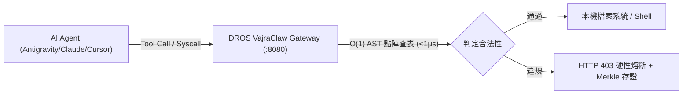

# 📐 Studio Rules — 專案級開發補充規範

> 本文件為 **專案級 (Project-Level)** 補充規則，僅在開發專案掛載時載入。
> 全域行為規範（溝通風格、Token 經濟學、Phase 生命週期、巨集指令）定義在 `GEMINI.md` 中。
> 本文件不應重複定義全域規則，以避免 Token 浪費。

---

## 1. 📋 Review Intensity Modes

控制審查嚴格度，可依專案階段動態切換：

| Mode | 行為 | 適用情境 |
|------|------|---------| 
| `full` | 每個 checkpoint 都執行完整審查 | 正式開發、多人協作 |
| `lean` | 跳過 per-task review，只在 milestone 審查 | 快速迭代、原型期 |
| `solo` | 最低限度審查，只驗證 artifacts 存在 | 個人 side project、hackathon |

設定方式：在專案根目錄 `.studio/review-mode.txt` 中寫入 `full`、`lean` 或 `solo`。

---

## 2. 🔧 Coding Standards

### 通用規則
- **No magic numbers** — 所有常數必須有命名
- **Comments explain WHY, not WHAT** — 程式碼本身應自解釋
- **Single Responsibility** — 一個函數做一件事
- **Error handling is not optional** — 每個可能失敗的操作都要處理

### TypeScript / JavaScript
- Strict mode enabled (`strict: true` in tsconfig)
- No `any` — use `unknown` + type guards
- Prefer `const` over `let`, never `var`
- Use named exports over default exports
- Async/await over raw promises
- **LLM 結構化輸出容錯規範 (Coercion-First & Path-Precise Validation)**：
  - 處理模型產出之 JSON 時，優先在本地執行確定性型別強制轉換（Coercion，如去除 Markdown 圍欄、字串數字轉型、布林正規化），**容錯修復優先於 API 重試**，杜絕無謂的 Token 浪費。
  - 驗證失敗需修正時，回注精準屬性路徑（如 `items[0].price: expected number`）至修正提示詞，引導模型一次性精準修復 (Reflexion)。


### Python
- Type hints on all public functions
- Use `pathlib` over `os.path`
- Prefer `dataclass` or `pydantic` over raw dicts
- Use `logging` module, not `print()`
- Handle exceptions with specific types, never bare `except:`
- **LLM 結構化輸出與資料契約 (Structured Output & Data Contracts)**：
  - 處理模型回傳之結構化資料時，優先使用原生 `pydantic.BaseModel.model_validate_json()` 搭配本地前置清洗。
  - 堅決拒絕引入小於 100 行之第三方極淺包裝庫（Shallow Wrappers）；複雜多模型結構化輸出首選業界標準（如 `instructor`）或廠商原生 API。

### Go
- Always wrap errors with `fmt.Errorf("context: %w", err)`
- Use `context.Context` as first parameter
- Check goroutine leaks — use `errgroup` or `sync.WaitGroup`
- Prefer interfaces for dependencies (dependency injection)

### Rust
- Minimize `unsafe` blocks — document WHY when needed
- Use `thiserror` for library errors, `anyhow` for applications
- Prefer `&str` over `String` in function parameters
- Use `clippy` lints as CI gate

### React / Vue
- Components < 200 lines — split if larger
- No business logic in components — extract to hooks/composables
- Proper key props on lists (no index-as-key unless static)
- Use React.memo / computed wisely — profile before optimizing

### PHP 8.4+ / Laravel 13+
- `declare(strict_types=1);` mandatory at the top of every PHP file
- Modern PHP 8.4+: Use property hooks, asymmetric visibility (`public private(set)`), readonly classes, backed enums, `#[\Override]`
- **Eloquent Property Shadowing Guard**: NEVER declare typed class properties directly on Eloquent Models for DB columns (e.g. `public private(set) string $title`); this shadows Eloquent's dynamic `$attributes` hydration, dirty checking, and relations. Reserve Asymmetric Visibility for DTOs, Value Objects, and Domain Actions.
- **Eloquent Casts**: Use method-based `protected function casts(): array` instead of `$casts` property
- **Thin Controller, Fat Action**: Never put raw DB queries or heavy logic in Controllers; use Invokable Actions
- **Eloquent Safety**: Never mass-assign without `$fillable`; always eager load (`with()`) to prevent N+1
- **Validation**: Use FormRequest classes with explicit `authorize(): bool` for all mutation endpoints
- **Testing**: Use Pest PHP 3+ with `RefreshDatabase` and `Http::fake()`

### Firebase
- Security rules MUST be tested before deploy
- Never trust client-side data — validate in rules AND functions
- Use batched writes for multi-document operations
- Index composite queries

---

## 3. 📝 Git Conventions

### Branch Naming
```
feature/PS-{id}-{short-description}
bugfix/PS-{id}-{short-description}
hotfix/PS-{id}-{short-description}
chore/{description}
```

### Commit Messages (Conventional Commits)
```
<type>(<scope>): <description>

[optional body]

[optional footer(s)]
```
Types: `feat`, `fix`, `docs`, `style`, `refactor`, `perf`, `test`, `chore`, `ci`, `build`

### PR Checklist
- [ ] Tests added/updated
- [ ] No console.log / print() left
- [ ] Error handling in place
- [ ] Types are correct (no `any`)
- [ ] Breaking changes documented
- [ ] Self-reviewed diff
- [ ] **README.md updated** (架構或功能變更必填)
- [ ] **GitHub synchronized** (`git push origin main` 保持遠端最新)

### 任務完成交割規範 (Task Completion & Sync Duty)
- **README 同步**：任何功能實作、架構決策、新工具評估或規範變更完成後，**必須同步更新 `README.md`**。
- **GitHub 即時推送**：確認測試通過與格式正確後，必須即時執行 `git add`、`git commit` 並 `git push origin main`，確保遠端代碼庫永遠保持最新與可重現。

---

## 4. 📊 Decision Framework (ADL Priority)

做技術決策時，優先順序：

> **Stability > Explainability > Reusability > Scalability > Novelty**

- ❌ 不要為了「看起來聰明」增加複雜度
- ❌ 不要做無法驗證的改動
- ❌ 不要犧牲穩定性追求新潮

### VFM Scoring (Value-First Modification)

非 trivial 改動前，評分：

| 維度 | 權重 | 問題 |
|------|------|------|
| High Frequency | 3x | 每天都會用到？ |
| Failure Reduction | 3x | 防止重複性故障？ |
| User Burden | 2x | 減少使用者負擔？ |
| Self Cost | 2x | 節省未來的 tokens/time？ |

**Score < 50 → 不要做。**

---

## 5. 🗂️ File-backed State & Memory

```
.studio/
├── stage.txt           # Current pipeline stage (phase0~phase6)
├── review-mode.txt     # Review intensity (full|lean|solo)
├── memory/             # Teamwork execution memory
│   ├── BRIEFING.md     # Project requirements & AC (created by Sentinel)
│   ├── prompt_draft.md # Phase 1 requirements draft
│   ├── plan.md         # Milestones & Tasks status tracking
│   └── progress.log    # MessageBus time-series event log
├── backlog/            # Epic and story markdown files
│   ├── epics/
│   └── stories/
├── sprints/            # Sprint plan and retro documents
├── adrs/               # Architecture Decision Records (ADR)
└── reviews/            # Code review, audit, and quality reports
```

---

## 6. 👥 Available Subagents (自主子代理人)

當執行 `/teamwork` 或複雜任務時，系統會自動調度以下核心代理人角色：

| Agent 名稱 | 角色職責 | 主要工具 / 運作 |
|------------|----------|-----------------| 
| `sentinel` | 專案指揮官 (Command) | 釐清需求，產出 `.studio/memory/BRIEFING.md` 專案任務書 |
| `orchestrator` | 協調大腦 (Orchestration) | 拆解任務為 `plan.md`，平行調度子 Lead，監控狀態與重試 |
| `auditor` | 獨立驗收稽核 (Audit) | 核對 `BRIEFING.md` 驗收標準，執行測試門禁，發出 PASS/REJECT |

---

## 7. 🛡️ 自動化驗收門禁 (Hooks)

本專案在 `hooks/` 目錄下實作了自動化門禁驗證。當執行特定操作時會觸發這些腳本：

1. **機密靜態掃描器 (`validate-secrets.js`)**：在寫入代碼或推送前掃描 API Key 與明文密碼，避免安全洩漏。
2. **資料庫遷移校驗 (`validate-db-migrations.js`)**：驗證 SQL Migration 檔案名稱格式，禁止 `DROP DATABASE/TABLE` 等破壞性 DDL。
3. **API 契約校驗 (`validate-api-schema.js`)**：檢查 API YAML Spec 結構與 TypeScript 型別介面的語法及括號完整性。

---

## 8. ⚡ Runtime Gateway Guard (DROS VajraClaw 執行期治理)

本框架支援掛載 DROS VajraClaw 確定性執行期安全網關（本地 Docker 端口 `:8080` 或 C-ABI 帶內攔截）：



### 守護規範要點：
1. **Zero-Trust Default Fail-Closed**：未在 `Vajra.md` / `dros_policy.yaml` 宣告為 ALLOW 的操作預設一律攔截。
2. **W3C `did:key` 身分認證**：子代理人派發唯讀 DID，物理隔離寫入與命令執行權限。
3. **不可逆破壞指令阻斷**：`rm -rf`、`DROP TABLE`、覆寫 `.env` 等毀滅性指令在系統呼叫前直接物理切斷。
4. **SHA-256 Merkle 審計鏈**：所有執行判定皆產出具備密碼學不可否認性的 Hash 鏈結日誌，杜絕日誌竄改。

### 🛡️ 自適應雙軌降級規範 (Adaptive Fallback)
1. **網關在線 (HTTP 200 `:8080/health`)**：
   - 啟用 **Strict Fail-Closed** 模式，所有 Tool Call 必須經 DROS AST 點陣表 $<1\mu\text{s}$ 硬熔斷。
2. **網關離線 (Connection Refused / 無 Docker 環境)**：
   - 自動優雅降級為 **Soft Guard 模式**（依靠 `GEMINI.md` Karpathy 護欄與 `hooks/` 門禁）。
   - Agent 在執行敏感操作前必須於對話中標記：`[⚠️ DROS Gateway Offline — Fallback to Soft Guard]`，確保開發流程不中斷。

---

## 9. 🧠 Thermodynamic Trust & Anti-Hallucination Gate (熱力學防幻覺門禁)

本專案採用 **Behavioral Trust Clustering (BTC)** 熱力學治理演算法，量化代碼生成信度並消除幻覺：

$$T = \text{PPV} \cdot \exp(-\sigma_{\text{calib}} \cdot T_{\text{comp}})$$

### 治理規範守則：
1. **非對稱效用信度評估**：針對核心/高危邏輯，要求模型標註 `CONFIDENCE: 0.0~1.0`（答對 +1，答錯 -3，棄權 0）。
2. **行為等價探針聚類**：關鍵演算法由 Auditor 執行 probe tests 驗證 I/O 行為等價性，而非僅比對 AST 語法。
3. **主動棄權門禁 (Abstention Gate)**：
   - **$T \ge 0.65$** ➡️ **ADMIT**（採納模態聚類解答）。
   - **$T < 0.65$**（或熵值 $\sigma_{\text{calib}} > 0.4$）➡️ **ABSTAIN**（主動棄權並觸發 Karpathy Rule #4 困惑即停，向使用者提問）。
4. **SHARS 微觀逐段防雪崩協議 (Segment-wise Anti-Snowballing)**：
   - 在多步生成時逐段拆解為原子事實（Atomic Claims）。
   - 若為混合真偽片段，觸發 `REWRITE` 協議動態修剪幻覺並僅保留已驗證事實，禁止整檔暴力重構。
   - 採樣失敗時啟動 Following 策略，將錯誤路徑保留為負向約束，引導模型避坑。

---

## 10. 📚 Standardized Prompt Conventions & Meta-Prompting (提示工程規範)

本專案所有 Prompt 模板遵循 `prompts/shared/prompt-schema.json` 規範：

1. **YAML Frontmatter 必填欄位**：包含 `mode`, `description`, `version`, `stack`, `patterns`, `eval_criteria`。
2. **Plan-and-Execute 範式**：生成代碼前必須先輸出 3–8 步可驗證行動計畫（Action Verb + Expected Output）。
3. **Reflexion 自我反思閉環**：當 Worker 代碼未通過 Reviewer/Auditor 驗收時，進入最多 2 輪自我診斷與修正迴圈。
4. **LLM-as-a-Judge 驗收量表**：Auditor 評估必須包含 Faithfulness ($\ge 4.5$), Constraint ($\ge 4.8$), Structure ($\ge 4.0$) 多維度量化打分。
5. **DSPy Signature 契約化簽名 (Declarative I/O Signatures)**：
   - 拒絕模糊散漫的文字指令，所有任務與 Prompt 必須具備清晰的宣告式簽名（`Signature: [Inputs] -> [Transformation] -> [Strict Outputs]`），以契約化代替字串拼貼。
6. **GEPA 反思演化突變 (Reflective Prompt Evolution, Stanford 2025)**：
   - 當單元測試或架構驗收失敗時，嚴禁無意義的隨機重新生成。Auditor 必須輸出結構化反思診斷（`Failure Rationale -> Root Cause -> Targeted Constraint Mutation`），將失敗路徑轉化為確定性負向約束，驅使模型進行單輪精準修復，避免盲目重試消耗 Token。

---

## 11. ⚡ PromptScript DSL & Universal Target Synchronization (單一真實來源與多 IDE 同步規範)

本專案所有代理人配置、子角色、階段狀態機、巨集指令與治理規則以 `.promptscript/` 作為 **Single Source of Truth**：

1. **DSL 模組分工**：
   - `7phase.prs`：全域 Identity、Metadata 與 Restriction 宣告。
   - `phases.prs`：Phase 0~6 階段狀態轉換與交付物規範。
   - `agents.prs`：Sentinel, Explorer, DB Architect, Backend Lead, Frontend Master, Reviewer, Critic, Auditor 角色能力。
   - `governance.prs`：DROS AST 熔斷、BTC 熱力學門禁與 Oxford SHARS 動態重寫。
   - `shortcuts.prs`：`/spec`, `/teamwork`, `/review`, `/trust`, `/diagnosing-bugs`, `/ui-check`, `/caveman`, `/audit`。
2. **跨平台編譯與驗證**：
   - 每次修改規則後，必須執行 `python scripts/sync_promptscript.py` 驗證語意一致性。
   - 支援透過 `promptscript.yaml` 一鍵編譯導出至 Antigravity (`.agent/rules/project.md`)、Claude Code (`CLAUDE.md`)、Cursor (`.cursor/rules/`)、GitHub Copilot (`.github/copilot-instructions.md`) 等 49+ 款目標環境。

---

## 12. 🔍 Project & External Tool Evaluation SOP (外部專案與工具評估三準則)

當使用者提供任何外部 GitHub 專案、工具庫、或前沿技術框架要求評估時，Agent **嚴禁盲目安裝或直接套用**。必須嚴格遵循以下三部曲評估報告框架，提供充分的判斷依據供使用者決策：

### 1. 核心定位與技術機制 (What It Does)
- **痛點與初衷**：該專案解決軟體工程、提示工程或代理人協作中的何種具體瓶頸？
- **底層實作架構**：運行環境、依賴複雜度、核心演算法或編譯解析機制。

### 2. 現況對標與深度比較 (Comparative Benchmark)
- **既有架構覆蓋度**：與現行 `7-Phase-Agentic-Workflow`、Antigravity 原生規範或專案既有模組重疊度為何？
- **差異與互補點**：它帶來了什麼我們現有系統完全沒有的能力？哪些部分存在冗餘或架構衝突？

### 3. 實裝路線、Token 節能效益與決策矩陣 (ROI & Decision Matrix)
- **Token 經濟學評估**：
  - 是否能在對話 Context、Prompt 載入、或除錯迴圈中帶來具體可量化的 Token 節省？
  - 亦或反而增加 Context 膨脹與多層抽象開銷？
- **實作效果提昇**：代碼生成正確率、工程邊界防護、跨平台同步效能的具體增益。
- **實裝方法 vs 學習優化**：
  - **路線 A（直接安裝）**：安裝全域/本地套件（依賴成本、維護負擔、版本衝突風險）。
  - **路線 B（純吸收優化 - 推薦優先）**：汲取其設計哲學、架構模式或核心算法，以原生零依賴 Python/腳本自主實作。
- **決策矩陣 (Go / No-Go / Hybrid)**：
  - 明確給出推薦選項與充分的判斷依據，待使用者審查授權後方可執行。

### 4. 超薄包裝層防坑準則 (Reject Shallow Wrappers Guard)
- **拒絕極淺封裝**：凡原始碼極短（<100 行）且僅轉調成熟套件（如 LiteLLM / OpenAI SDK）之極淺包裝層，未提供重試、容錯 (Coercion) 或自修復等核心獨立演算法者，一律判定為「無引入價值 (No-Go)」，嚴禁盲目引入第三方依賴負擔，優先採用原生 SDK 或成熟業界標準庫（如 `instructor`）。

---

## 13. 💎 8 大刻面上下文膠囊與可審計交接規範 (8-Facet Auditable Context Capsule)

本專案吸納 Context Diamond 確定性架構並針對繁體中文語意優化，取代傳統片段拼貼式摘要。在跨 Phase 切換、長任務交接或執行 `/prune` 時，強制採用 **8 大刻面膠囊 + Loss Report** 作為 Single Source of Truth：

1. 💓 **當前脈動 (Pulse)**：任務現況的一句話簡報與當前 Phase（如 Phase 4 Implement）。
2. 🎯 **目標與驗收 (Goal & Acceptance)**：核心交付價值、成功標準與驗收測試條件。
3. 🛡️ **規則與硬約束 (Rules & Constraints)**：技術棧約束、不可動到的代碼範圍、安全護欄 (must/never/avoid)。
4. ⚖️ **已定案決策 (Decisions Already Made)**：已定案的架構選型、演算法取捨，附帶 Why。
5. 🏛️ **穩定事實 (Stable Facts)**：經過驗證的環境變數、相容版本、系統前提條件。
6. 📈 **目前狀態 (Current Working State)**：進行中的檔案、分支狀態、剛通過的測試。
7. 🚧 **未決問題與風險 (Open Loops & Risks)**：目前的 Blockers、潛在死角、待確認外部依賴。
8. ⚓ **代碼實體與錨點 (Entities & Anchors)**：關鍵檔案路徑、Symbol 符號、核心函數/類別名稱。
9. 🔍 **遺失審計報告 (Loss Report)**：明列本次壓縮主動剪除的噪訊（如重複報錯日誌、已排除之試錯路徑），杜絕暗箱截斷。

---

## 14. 🔄 State Reducer 狀態聚合與 Human-in-the-Loop 中斷門禁 (StateGraph Governance)

本專案吸納 LangGraph 循環狀態圖編排哲學，為長流程多代理人協作建立狀態融合與安全中斷標準：

### 1. State Reducer 刻面狀態增量聚合規則 (Facet Reducer Rules)
跨 Phase 轉換或執行上下文交接時，8 大刻面依照精確的 Reducer 策略進行狀態融合，防止狀態覆蓋與資訊遺失：
- **Append-Only（只增不減 + 去重）**：
  - `Decisions Already Made`（架構決策累積）
  - `Rules & Constraints`（安全約束與負向引導）
  - `Stable Facts`（環境與相容性前提）
- **Reconcile & Prune（比對核銷）**：
  - `Open Loops & Risks`（已解決問題移出並記錄至 Facts，未解決的保留並更新風險等級）
- **Overwrite-Latest（覆寫最新）**：
  - `Pulse`（當前心跳與階段宣告）
  - `Current Working State`（當前活躍檔案與測試結果）
  - `Goal & Acceptance`（當前階段子目標）
  - `Loss Report`（本次壓縮修剪之日誌）

### 2. Human-in-the-Loop 顯式中斷門禁 (Explicit Breakpoint Gates)
借鑑 LangGraph `interrupt_before` 思想，在執行以下高危操作前，Agent **禁止自主執行，必須觸發硬性中斷點**，向人類提交 Impact Plan 並等待確認：
1. **結構變更**：資料庫 Migration / 破壞性 Schema 變更 / `DROP` / `TRUNCATE`。
2. **環境破壞**：刪除已有模組、覆寫 `.env` 或重設重要全域設定。
3. **架構分歧**：當 Reviewer / Critic 連續 2 輪反駁或發現根本性設計缺陷時。

---

## 15. ⚡ Tool Call Batching & Token 節能驗證管線 (Token Economy SOP)

為解決多輪工具呼叫（Multi-Step Tool Calls）導致上下文重複傳輸與 Token 線性暴增問題，專案強制實施「一鍵鏈路合併 (Batching)」與「極簡日誌回傳 (Quiet Logs)」標準：

### 1. 統一驗證入口規範 (`scripts/verify_all.py`)
- **禁止分步分散驗證**：嚴禁連續發起 4 次獨立 Tool Call 分別跑 DSL、Schema、Trust Governor 與 UI 測試。
- **一鍵秒級批次矩陣**：統一使用 `python scripts/verify_all.py`，以單一 Tool Call 在 <1 秒內完成 4 大測試套件驗證。
- **極簡回傳防膨脹 (Quiet-by-Default)**：成功時僅回傳 5~7 行摘要（節省 90% stdout Context）；僅在失敗或 `--verbose` 時展開錯誤堆疊。

### 2. 落地發布管線合併 (Full Ship Pipeline)
完成變更後，優先將「驗證 ➔ 暫存 ➔ 提交 ➔ 推送 ➔ 快照」串接為單一復合指令或腳本，減少中間 API 來回次數：
```bash
python scripts/verify_all.py && git add . && git commit -m "feat/fix: ..." && git push origin main
```

---

## 16. 🛡️ 專案自研三大核心兵器 (Three Indigenous Weapons)

為徹底發揮 Gemini 的極速與超長上下文優勢，專案內建三款零外部依賴的純 Python 兵器：

### 1. 8 刻面膠囊自動生成與稽核器 (`scripts/capsule.py`)
- **指令**：`python scripts/capsule.py export [-o .agent/CAPSULE.md]`、`python scripts/capsule.py verify`。
- **作用**：自 Git 提交歷程、修改狀態與環境事實自動提煉 8 刻面可審計膠囊與 Loss Report，跨對話交接 1 秒完成，對話重置後立即省下 80% Input Tokens。

### 2. UI/UX Anti-Slop 視覺預檢引擎 (`scripts/ui_audit.py`)
- **指令**：`python scripts/ui_audit.py <file_or_dir> [--check] [--threshold 80]`。
- **作用**：依據 `frontend-taste-v2` 自動掃描前端代碼，精確捕捉「無趣三等分卡片」、「紫藍漸層陳腔濫調」、「缺乏微互動 (hover/active/transition)」等 AI Slop 特徵，給出 0~100 抗罐頭評分並動態推薦 BM25 頂級替代樣式。

### 3. GEPA 自我修復反思迴圈 (`scripts/reflexion.py`)
- **指令**：`python scripts/reflexion.py run "<test_command>"`。
- **作用**：實作 Stanford 2025 GEPA 論文核心機制。測試或驗證失敗時，拒絕盲目重新嘗試，自動攔截錯誤堆疊並提取精準路徑與根因，生成非妥協性靶向負向約束（`Targeted Constraint Mutation`），指引 Gemini 於單輪內精確修復，杜絕試錯浪費。

---

## 17. 📦 Instructor 結構化輸出精髓：可操作驗證錯誤與三級降級容錯 (Actionable Validation & Tri-Mode Fallback)

本專案吸納 Instructor (`567-labs/instructor`) 核心架構精華，不引入重型依賴，沉澱為全端結構化資料萃取與驗證黃金標準：

### 1. Pydantic 欄位驗證反饋合約 (Actionable ValidationError Contract)
當定義 Pydantic 模型之自訂驗證器 (`@field_validator` / `@model_validator`) 時，**禁止拋出乾癟模糊的報錯**，必須提供「模型一眼即懂的修正引導」：
- ❌ 錯誤示範：`raise ValueError("invalid status")`（模型盲試）
- ✅ 正確規範：
  ```python
  @field_validator("status")
  @classmethod
  def validate_status(cls, v: str) -> str:
      allowed = ["draft", "published", "archived"]
      if v not in allowed:
          raise ValueError(f"Invalid status '{v}'. MUST be strictly one of: {allowed}")
      return v
  ```
  當驗證失敗時，此引導字串能精確作為下輪 Reflection 輸入，達成 1 輪百分之百修復。

### 2. 結構化輸出三級降級容錯矩陣 (Tri-Mode Fallback Hierarchy)
面對不同模型環境或 API 支援度，嚴格落實三級安全降級防線，杜絕解析崩潰：
1. **Tier 1 (原生最佳)**：`NATIVE_JSON_SCHEMA`（使用模型廠商原生結構化輸出約束，如 Gemini `response_schema`）。
2. **Tier 2 (廣泛相容)**：`TOOL_CALLING`（將期望之 Schema 宣告為單一 Tool/Function 呼叫參數，強制結構化回傳）。
3. **Tier 3 (終極保底)**：`MARKDOWN_JSON + Coercion`（正則提取 ` ```json ` 圍欄，並於本地執行寬容型別修剪轉型，完全不消耗額外 API 重試）。

---

## 18. ⚡ System 1 快思考決策原語與極速非自回歸路由門禁 (System 1 Primitives & Zero-Output Gate)

本專案吸納 TypeSafe AI Jev「System One Models」架構哲學，不引入閉源外部依賴，確立軟體自動化中快慢決策的雙軌分流規範：

### 1. 三大決策原語標準 (Canonical Decision Primitives)
在日常開發與工作流內部，高頻軟體決策全面重構為三大原語，**嚴禁呼叫生成式大模型撰寫無意義的自然語言長篇大論**：
- **`Noul` (Boolean / 二元開關)**：用於安全護欄、Prompt Injection 檢查、檔案是否受影響、測試是否通過。輸出 `true`/`false` 與校準信度。
- **`Choice` (Categorical / 候選路由)**：用於子代理人派發、工單分類、技術棧識別。提供明確枚舉候選集，輸出最優標籤與分佈權重。
- **`Score` (Continuous / 連續評分)**：用於 RAG 相關度評估、任務緊急程度、代碼異味等級。輸出 `0.0 ~ 1.0` 浮點數與信度。

### 2. 雙軌自適應降級矩陣 (Dual-Track Adaptive Hierarchy)
所有高頻判斷優先走 System 1 快路徑，達成輸出端零 Token 浪費與毫秒級延遲：
1. **Fast-Path (System 1 零耗時)**：調用 `scripts/system_one.py` 或本地確定性啟發式規則，延遲 `<5ms`，輸出 Token 費用為 $0。
2. **Cloud Adapter (System 1 API 擴充)**：若設定 `TYPESAFE_API_KEY`，可透明掛載 Jev 非自回歸決策 API (70~500ms)。
3. **Fallback Gate (System 2 慢思考深推理)**：當 System 1 校準信度低於門檻（預設 `< 0.75`）或面臨高度語意歧義時，主動釋放控制權，降級呼叫 Frontier LLM (Gemini/Claude) 進行多步長思考推理。

---

## 19. 🔄 Loop Engineering 雙軌閉環架構與安全硬門禁 (Dual-Track State & Safety Gates)

本專案全面融合 Cobus Greyling 與 Addy Osmani 之 **Loop Engineering（迴圈工程）** 體系，將 Agent 協作由手動逐回合 Prompting 升級為自主閉環控制系統：

### 1. 雙軌記憶架構 (Dual-Track State Architecture)
- **微觀軌道 (`SNAPSHOT.jsonl`)**：記錄每一個 milestone、decision、handoff 的高頻歷史事件日誌。
- **宏觀軌道 (`STATE.md`)**：作為專案活體狀態脊椎（State Spine），維護 `High Priority`、`Watch List` 與 `Recent Noise`。新會話啟動時優先讀取，開場以 0 Token 成本瞬間重建全局視野。

### 2. 機械化安全門禁 (`gate.yaml`)
拒絕依賴 Agent 的自律假設，以實體設定檔進行物理硬阻斷：
- **Path Denylist**：嚴禁自動修改敏感路徑（`.env*`, `credentials/**`, `secrets/**`, `auth/**`, `billing/**`, `migrations/**`）。
- **變更上限 (`maxFiles: 8`)**：單次變更超過 8 個檔案判定為意圖偏離，強制退出並向人類 Maintainer 升級。
- **Auto-Merge 白名單**：預設全面禁止自動合併，僅放行純文件（`docs/**`, `*.md`）與獨立單元測試。

### 3. Maker / Checker 角色硬分離
- **Maker (實作者)**：專注撰寫代碼與提供 diff，嚴禁自行宣稱「測試已通過」或結案打勾。
- **Checker (驗證者 / loop-verifier)**：獨立執行真實測試命令，以「預設 REJECT」為原則稽核 diff scope、測試結果與代碼實質性（零容忍假測試與 TODO 佔位符）。

### 4. 預算守護與緊急熔斷 (`loop-budget.md`)
- 每日設定 Token 消耗上限與單次任務上限。
- 消耗達到 80% 時自動降級為 Report-only 唯讀巡檢模式；若觸發異常連鎖錯誤，立即啟用 `loop-pause-all: true` 物理熔斷。

### 5. 跨層級執行優先級與時序規範 (Execution Precedence Hierarchy)
面對任何 Agent 動作，系統嚴格依循由硬至軟、由快至慢的四級執行時序，杜絕層級衝突：
1. **Level 0 (Zero-Order Physical Gate — 最高物理優先級)**：`scripts/loop_gate.py`。在任何實體檔案讀寫前執行，強制檢驗 `gate.yaml` 之 Denylist 與變更上限（`maxFiles: 8`），並自動正規化 Windows 反斜線（`\` -> `/`）。若違規立即 Exit 2 物理熔斷，**直接無條件終止後續所有決策**。
2. **Level 1 (System 1 Fast Classifier)**：`scripts/system_one.py`。若 Level 0 放行，進行非自回歸快初篩（`Noul` / `Choice` / `Score`），延遲 `<5ms`，Token 消耗 $0。
3. **Level 2 (System 2 Deep Reasoning & Maker)**：若 System 1 判斷需深推理或校準信度不足（`< 0.75`），交由 Frontier LLM 遵循 Phase 0-6 規範產出實質代碼與測試。
4. **Level 3 (Loop Verifier & State Spine Sync)**：獨立 Checker 跑真實 test suite，驗證通過後雙軌回寫 `STATE.md` 狀態脊椎與 `SNAPSHOT.jsonl` 事件日誌。

---

## 20. 🎨 Generative UI 與動態目錄合約規範 (Generative UI & Catalog Governance)

本專案吸納 `json-render` (Vercel Labs)「讓 AI 負責數據組合，前端負責渲染」之核心哲學，將 Generative UI 納入全端開發與契約規範，嚴格杜絕 LLM 直接生成原始未受控代碼帶來的 XSS、組件幻覺與樣式失控：

### 1. Catalog-First SDD 白名單原則 (Strict Catalog White-Listing)
- **封閉白名單**：所有 Generative UI 必須使用 Zod 於獨立 `catalog.ts` 中以 `defineCatalog` 嚴格宣告組件清單與屬性邊界。禁止允許 AI 調用未經註冊之動態組件或任意執行原始 JavaScript。
- **Actionable Validation 錯誤引導**：參照第 17 節 Instructor 精神，組件 Props 之 Zod 驗證器必須提供具體修正建議（例如：`z.enum(['card', 'metric']).describe("MUST be strictly 'card' or 'metric'")`），便於模型單輪精準自我修復。
- **分離關注點**：純 Schema（`catalog.ts`）與前端 React 實作（`registry.tsx`）必須物理分離，渲染層一律採用原生 Design System 組件（如 Radix / Tailwind），保障 100% 設計規範遵從。

### 2. System 1 動態目錄裁剪路由 (Dynamic Catalog Pruning via System 1)
- **Prompt Token 防膨脹**：嚴禁在組件數量龐大（>15 個）時直接調用 `catalog.prompt()` 將全部 Schema 塞進 System Prompt，此舉會引發數千 Token 的持續開銷。
- **毫秒級意圖快篩**：在調用生成式 LLM 前，強制調用 `scripts/system_one.py` 之 `Choice` 原語（延遲 `<5ms`，輸出 Token 費用 $0）辨識當前業務領域（如 `analytics`、`forms`、`tables`），動態過濾並僅載入該領域的最小 Catalog 子集（5~8 個組件），使 System Prompt Token 驟降 70%~85%。

### 3. SpecStream RFC 6902 本地容錯防線 (Coercion-First Streaming Guard)
- **Patch 容錯修剪**：前端在接收以 JSONL 形式傳輸之 RFC 6902 JSON Patch（`add`, `replace`, `remove`）時，強制實施本地 Coercion 容錯處理：
  1. 自動清洗 Markdown 圍欄（` ```jsonl `）。
  2. 自動補齊缺失之路徑前綴（若為 `elements/node1` 補齊為 `/elements/node1`）。
  3. 寬容型別轉換（如字串轉數字）。
- **杜絕全樹崩潰**：單一無效 Patch 僅觸發警告或局部略過，禁止引發前台整樹 Unmount 或白屏死當。

### 4. Catalog 組件審美與 Anti-Slop 門禁 (Catalog Aesthetic Guard)
- **拒絕罐頭排列**：AI 拼裝 UI 極易退化為「對稱三等分卡片堆疊」之 AI Slop 乏味介面。
- **靜態預檢門禁**：在 Phase 3 設計 Catalog 組件庫時，強制使用 `python scripts/ui_audit.py` 進行代碼掃描：
  1. Catalog 內之 Atoms/Molecules 必須包含微互動狀態（`hover:`, `focus-visible:`, 轉場動效）。
  2. 強制定義非對稱排版組件（如 Bento Grid、Split Hero、Timeline），禁止僅提供單一對稱矩形容器。


