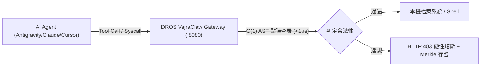

# 📐 Studio Rules — 專案級開發補充規範

> 本文件為 **專案級 (Project-Level)** 補充規則，僅在開發專案掛載時載入。
> 全域行為規範（溝通風格、Token 經濟學、Phase 生命週期、巨集指令）定義在 `GEMINI.md` 中。
> 本文件不應重複定義全域規則，以避免 Token 浪費。

---

## 1. 📋 Review Intensity Modes

控制審查嚴格度，可依專案階段動態切換：

| Mode | 行為 | 適用情境 |
|------|------|---------| 
| `full` | 每個 checkpoint 都執行完整審查 | 正式開發、多人協作 |
| `lean` | 跳過 per-task review，只在 milestone 審查 | 快速迭代、原型期 |
| `solo` | 最低限度審查，只驗證 artifacts 存在 | 個人 side project、hackathon |

設定方式：在專案根目錄 `.studio/review-mode.txt` 中寫入 `full`、`lean` 或 `solo`。

---

## 2. 🔧 Coding Standards

### 通用規則
- **No magic numbers** — 所有常數必須有命名
- **Comments explain WHY, not WHAT** — 程式碼本身應自解釋
- **Single Responsibility** — 一個函數做一件事
- **Error handling is not optional** — 每個可能失敗的操作都要處理

### TypeScript / JavaScript
- Strict mode enabled (`strict: true` in tsconfig)
- No `any` — use `unknown` + type guards
- Prefer `const` over `let`, never `var`
- Use named exports over default exports
- Async/await over raw promises

### Python
- Type hints on all public functions
- Use `pathlib` over `os.path`
- Prefer `dataclass` or `pydantic` over raw dicts
- Use `logging` module, not `print()`
- Handle exceptions with specific types, never bare `except:`

### Go
- Always wrap errors with `fmt.Errorf("context: %w", err)`
- Use `context.Context` as first parameter
- Check goroutine leaks — use `errgroup` or `sync.WaitGroup`
- Prefer interfaces for dependencies (dependency injection)

### Rust
- Minimize `unsafe` blocks — document WHY when needed
- Use `thiserror` for library errors, `anyhow` for applications
- Prefer `&str` over `String` in function parameters
- Use `clippy` lints as CI gate

### React / Vue
- Components < 200 lines — split if larger
- No business logic in components — extract to hooks/composables
- Proper key props on lists (no index-as-key unless static)
- Use React.memo / computed wisely — profile before optimizing

### PHP 8.4+ / Laravel 13+
- `declare(strict_types=1);` mandatory at the top of every PHP file
- Modern PHP 8.4+: Use property hooks, asymmetric visibility (`public private(set)`), readonly classes, backed enums, `#[\Override]`
- **Eloquent Property Shadowing Guard**: NEVER declare typed class properties directly on Eloquent Models for DB columns (e.g. `public private(set) string $title`); this shadows Eloquent's dynamic `$attributes` hydration, dirty checking, and relations. Reserve Asymmetric Visibility for DTOs, Value Objects, and Domain Actions.
- **Eloquent Casts**: Use method-based `protected function casts(): array` instead of `$casts` property
- **Thin Controller, Fat Action**: Never put raw DB queries or heavy logic in Controllers; use Invokable Actions
- **Eloquent Safety**: Never mass-assign without `$fillable`; always eager load (`with()`) to prevent N+1
- **Validation**: Use FormRequest classes with explicit `authorize(): bool` for all mutation endpoints
- **Testing**: Use Pest PHP 3+ with `RefreshDatabase` and `Http::fake()`

### Firebase
- Security rules MUST be tested before deploy
- Never trust client-side data — validate in rules AND functions
- Use batched writes for multi-document operations
- Index composite queries

---

## 3. 📝 Git Conventions

### Branch Naming
```
feature/PS-{id}-{short-description}
bugfix/PS-{id}-{short-description}
hotfix/PS-{id}-{short-description}
chore/{description}
```

### Commit Messages (Conventional Commits)
```
<type>(<scope>): <description>

[optional body]

[optional footer(s)]
```
Types: `feat`, `fix`, `docs`, `style`, `refactor`, `perf`, `test`, `chore`, `ci`, `build`

### PR Checklist
- [ ] Tests added/updated
- [ ] No console.log / print() left
- [ ] Error handling in place
- [ ] Types are correct (no `any`)
- [ ] Breaking changes documented
- [ ] Self-reviewed diff

---

## 4. 📊 Decision Framework (ADL Priority)

做技術決策時，優先順序：

> **Stability > Explainability > Reusability > Scalability > Novelty**

- ❌ 不要為了「看起來聰明」增加複雜度
- ❌ 不要做無法驗證的改動
- ❌ 不要犧牲穩定性追求新潮

### VFM Scoring (Value-First Modification)

非 trivial 改動前，評分：

| 維度 | 權重 | 問題 |
|------|------|------|
| High Frequency | 3x | 每天都會用到？ |
| Failure Reduction | 3x | 防止重複性故障？ |
| User Burden | 2x | 減少使用者負擔？ |
| Self Cost | 2x | 節省未來的 tokens/time？ |

**Score < 50 → 不要做。**

---

## 5. 🗂️ File-backed State & Memory

```
.studio/
├── stage.txt           # Current pipeline stage (phase0~phase6)
├── review-mode.txt     # Review intensity (full|lean|solo)
├── memory/             # Teamwork execution memory
│   ├── BRIEFING.md     # Project requirements & AC (created by Sentinel)
│   ├── prompt_draft.md # Phase 1 requirements draft
│   ├── plan.md         # Milestones & Tasks status tracking
│   └── progress.log    # MessageBus time-series event log
├── backlog/            # Epic and story markdown files
│   ├── epics/
│   └── stories/
├── sprints/            # Sprint plan and retro documents
├── adrs/               # Architecture Decision Records (ADR)
└── reviews/            # Code review, audit, and quality reports
```

---

## 6. 👥 Available Subagents (自主子代理人)

當執行 `/teamwork` 或複雜任務時，系統會自動調度以下核心代理人角色：

| Agent 名稱 | 角色職責 | 主要工具 / 運作 |
|------------|----------|-----------------| 
| `sentinel` | 專案指揮官 (Command) | 釐清需求，產出 `.studio/memory/BRIEFING.md` 專案任務書 |
| `orchestrator` | 協調大腦 (Orchestration) | 拆解任務為 `plan.md`，平行調度子 Lead，監控狀態與重試 |
| `auditor` | 獨立驗收稽核 (Audit) | 核對 `BRIEFING.md` 驗收標準，執行測試門禁，發出 PASS/REJECT |

---

## 7. 🛡️ 自動化驗收門禁 (Hooks)

本專案在 `hooks/` 目錄下實作了自動化門禁驗證。當執行特定操作時會觸發這些腳本：

1. **機密靜態掃描器 (`validate-secrets.js`)**：在寫入代碼或推送前掃描 API Key 與明文密碼，避免安全洩漏。
2. **資料庫遷移校驗 (`validate-db-migrations.js`)**：驗證 SQL Migration 檔案名稱格式，禁止 `DROP DATABASE/TABLE` 等破壞性 DDL。
3. **API 契約校驗 (`validate-api-schema.js`)**：檢查 API YAML Spec 結構與 TypeScript 型別介面的語法及括號完整性。

---

## 8. ⚡ Runtime Gateway Guard (DROS VajraClaw 執行期治理)

本框架支援掛載 DROS VajraClaw 確定性執行期安全網關（本地 Docker 端口 `:8080` 或 C-ABI 帶內攔截）：



### 守護規範要點：
1. **Zero-Trust Default Fail-Closed**：未在 `Vajra.md` / `dros_policy.yaml` 宣告為 ALLOW 的操作預設一律攔截。
2. **W3C `did:key` 身分認證**：子代理人派發唯讀 DID，物理隔離寫入與命令執行權限。
3. **不可逆破壞指令阻斷**：`rm -rf`、`DROP TABLE`、覆寫 `.env` 等毀滅性指令在系統呼叫前直接物理切斷。
4. **SHA-256 Merkle 審計鏈**：所有執行判定皆產出具備密碼學不可否認性的 Hash 鏈結日誌，杜絕日誌竄改。

### 🛡️ 自適應雙軌降級規範 (Adaptive Fallback)
1. **網關在線 (HTTP 200 `:8080/health`)**：
   - 啟用 **Strict Fail-Closed** 模式，所有 Tool Call 必須經 DROS AST 點陣表 $<1\mu\text{s}$ 硬熔斷。
2. **網關離線 (Connection Refused / 無 Docker 環境)**：
   - 自動優雅降級為 **Soft Guard 模式**（依靠 `GEMINI.md` Karpathy 護欄與 `hooks/` 門禁）。
   - Agent 在執行敏感操作前必須於對話中標記：`[⚠️ DROS Gateway Offline — Fallback to Soft Guard]`，確保開發流程不中斷。

---

## 9. 🧠 Thermodynamic Trust & Anti-Hallucination Gate (熱力學防幻覺門禁)

本專案採用 **Behavioral Trust Clustering (BTC)** 熱力學治理演算法，量化代碼生成信度並消除幻覺：

$$T = \text{PPV} \cdot \exp(-\sigma_{\text{calib}} \cdot T_{\text{comp}})$$

### 治理規範守則：
1. **非對稱效用信度評估**：針對核心/高危邏輯，要求模型標註 `CONFIDENCE: 0.0~1.0`（答對 +1，答錯 -3，棄權 0）。
2. **行為等價探針聚類**：關鍵演算法由 Auditor 執行 probe tests 驗證 I/O 行為等價性，而非僅比對 AST 語法。
3. **主動棄權門禁 (Abstention Gate)**：
   - **$T \ge 0.65$** ➡️ **ADMIT**（採納模態聚類解答）。
   - **$T < 0.65$**（或熵值 $\sigma_{\text{calib}} > 0.4$）➡️ **ABSTAIN**（主動棄權並觸發 Karpathy Rule #4 困惑即停，向使用者提問）。
4. **SHARS 微觀逐段防雪崩協議 (Segment-wise Anti-Snowballing)**：
   - 在多步生成時逐段拆解為原子事實（Atomic Claims）。
   - 若為混合真偽片段，觸發 `REWRITE` 協議動態修剪幻覺並僅保留已驗證事實，禁止整檔暴力重構。
   - 採樣失敗時啟動 Following 策略，將錯誤路徑保留為負向約束，引導模型避坑。

---

## 10. 📚 Standardized Prompt Conventions & Meta-Prompting (提示工程規範)

本專案所有 Prompt 模板遵循 `prompts/shared/prompt-schema.json` 規範：

1. **YAML Frontmatter 必填欄位**：包含 `mode`, `description`, `version`, `stack`, `patterns`, `eval_criteria`。
2. **Plan-and-Execute 範式**：生成代碼前必須先輸出 3–8 步可驗證行動計畫（Action Verb + Expected Output）。
3. **Reflexion 自我反思閉環**：當 Worker 代碼未通過 Reviewer/Auditor 驗收時，進入最多 2 輪自我診斷與修正迴圈。
4. **LLM-as-a-Judge 驗收量表**：Auditor 評估必須包含 Faithfulness ($\ge 4.5$), Constraint ($\ge 4.8$), Structure ($\ge 4.0$) 多維度量化打分。

---

## 11. ⚡ PromptScript DSL & Universal Target Synchronization (單一真實來源與多 IDE 同步規範)

本專案所有代理人配置、子角色、階段狀態機、巨集指令與治理規則以 `.promptscript/` 作為 **Single Source of Truth**：

1. **DSL 模組分工**：
   - `7phase.prs`：全域 Identity、Metadata 與 Restriction 宣告。
   - `phases.prs`：Phase 0~6 階段狀態轉換與交付物規範。
   - `agents.prs`：Sentinel, Explorer, DB Architect, Backend Lead, Frontend Master, Reviewer, Critic, Auditor 角色能力。
   - `governance.prs`：DROS AST 熔斷、BTC 熱力學門禁與 Oxford SHARS 動態重寫。
   - `shortcuts.prs`：`/spec`, `/teamwork`, `/review`, `/trust`, `/diagnosing-bugs`, `/ui-check`, `/caveman`, `/audit`。
2. **跨平台編譯與驗證**：
   - 每次修改規則後，必須執行 `python scripts/sync_promptscript.py` 驗證語意一致性。
   - 支援透過 `promptscript.yaml` 一鍵編譯導出至 Antigravity (`.agent/rules/project.md`)、Claude Code (`CLAUDE.md`)、Cursor (`.cursor/rules/`)、GitHub Copilot (`.github/copilot-instructions.md`) 等 49+ 款目標環境。
