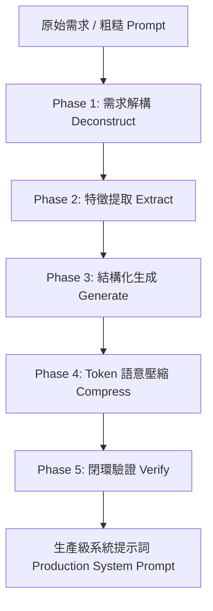

# PromptCraft — 高階 LLM 提示詞工程與編排技能

> **核心理念**：提示詞即代碼 (Prompt as Code)。
> 專為 Google Gemini API 與先進大型語言模型（LLM）設計，透過結構化編排、XML 標籤隔離、語意 Token 壓縮與邊界條件強化，產出高穩定、低延遲、省成本的生產級系統提示詞（System Instructions）。

---

## 🎯 何時使用 (When to Use)

- 使用者輸入 `/promptcraft` 或提及「優化提示詞」、「寫提示詞」、「系統提示詞」、「Prompt 工程」。
- 使用者給出一段粗糙、冗長或模糊的提示詞需求，希望轉化為專業級、結構化的 LLM Prompt。
- 需要大幅降低 Prompt 的 Token 消耗（Token Compression），同時確保模型遵循約束。
- 需要為特定 Agent / Tool 建立具備嚴格輸入輸出契約（Contract）與安全邊界的 System Prompt。

---

## 🔄 5 階段處理流水線 (The 5-Stage Pipeline)



---

### Phase 1：需求解構 (Requirement Deconstruction)

將使用者的原始請求拆解為標準三元組，並顯性化所有隱性需求：

1. **Goal（核心目標）**：模型最終要解決什麼問題？產出什麼價值？
2. **Constraints（邊界限制）**：技術棧、語言、格式、長度、禁止事項。
3. **Context（上下文與依賴）**：輸入來源、運行環境、依賴資料庫/API。

---

### Phase 2：特徵提取 (Feature Extraction & Strategy)

從解構結果中提煉四大維度：

1. **Role Profile（專家角色定位）**：精準 Persona、專業深度、語氣風格（例如：資深資安架構師、精準 Python 分析師）。
2. **Input-Output Contract（契約定義）**：輸入格式（JSON/Markdown）、輸出 Schema、必填欄位。
3. **Strict Constraints（硬性負面約束 / Negative Constraints）**：
   - ❌ 嚴禁幻覺（No Hallucination）
   - ❌ 嚴禁未要求的多餘客套話 / 結論（No Boilerplate / Pleasantries）
   - ❌ 嚴禁佔位符（No TODOs / Placeholders）
4. **Demonstrations（少樣本範例 Few-Shot / One-Shot）**：
   - 提供 1~2 組代表性高、涵蓋邊界條件的 `<example>` 輸入與輸出對。

---

### Phase 3：結構化生成 (Structured Generation)

遵循 Gemini 與先進 LLM 官方最佳實踐，使用清楚的 XML 標籤與 Markdown 階層包覆提示詞，防止模型在長上下文時注意力渙散：

#### 結構化模板規範 (Template Standard)：

```xml
<role>
精確定義模型扮演的專家角色與核心職責。
</role>

<context>
說明任務背景、運行環境與依賴規格。
</context>

<rules>
## 硬性規則 (Strict Rules)
1. 規則一...
2. 規則二...
## 禁止事項 (Forbidden)
- 嚴禁...
</rules>

<input_format>
說明輸入資料的結構或 JSON Schema。
</input_format>

<output_format>
明確定義輸出格式（如純 JSON、指定 Markdown 欄位、diff 區塊）。
</output_format>

<examples>
<example>
<input>範例輸入</input>
<output>範例預期輸出</output>
</example>
</examples>
```

---

### Phase 4：Token 語意壓縮 (Token Compression)

對生成後的提示詞執行雙重壓縮演算法：

1. **無損壓縮 (Lossless)**：
   - 清除多餘連續空行、尾隨空格。
   - 壓縮標點符號與冗餘 Markdown 格式。
2. **有損語意壓縮 (Lossy Semantic)**：
   - 移除無效低資訊密度詞彙（如「請務必」、「基本上」、「非常」、「記得要」等）。
   - 將冗長複合句轉為高資訊密度的祈使句/清單。
   - 預期節省 **30% ~ 50%** 輸入 Token 體積。

---

### Phase 5：閉環驗證與評估 (Verification & Scoring)

依據 **PromptCraft 評估矩陣** 自檢並評分：

| 評估維度 | 檢驗標準 | 權重 |
|---|---|---|
| **明確性 (Clarity)** | 角色定義與目標是否毫無歧義？ | 25% |
| **邊界完整性 (Boundaries)** | 是否有清晰的 Negative Constraints 與例外處理？ | 25% |
| **格式嚴謹度 (Schema Adherence)** | XML/JSON 契約是否能保證模型 100% 格式對齊？ | 25% |
| **Token 能效比 (Token Efficiency)** | 是否已去除所有贅詞，達到最高資訊密度？ | 25% |

---

## 📋 輸出交付格式

當為使用者打造/優化提示詞時，請依序輸出：

1. **📊 優化分析報告**：說明原始問題、提取的特徵與壓縮比例。
2. **🚀 生產級系統提示詞 (Production System Prompt)**：完整的 Markdown/XML 程式碼區塊（可直接複製使用）。
3. **🧪 測試案例與呼叫範例**：提供一組測試 Prompt 與預期行為驗證。
