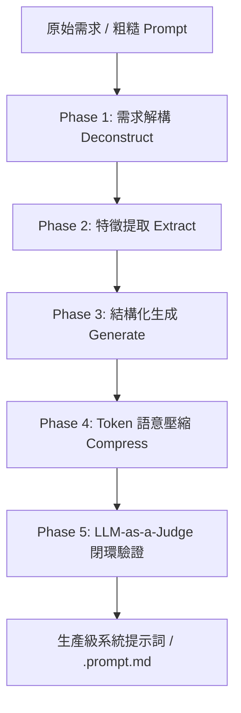

# PromptCraft — 高階 LLM 提示詞工程與 Agentic 認知架構

> **核心理念**：提示詞即代碼 (Prompt as Code) ＋ 認知架構即提示 (Cognitive Architecture as Prompt)。
> 專為先進大型語言模型（LLM）設計，透過結構化編排、YAML Frontmatter、XML 標籤隔離、語意 Token 壓縮與 LLM-as-a-Judge 驗證矩陣，產出生產級系統提示詞與自主 Agent 提示藍圖。

---

## 🎯 何時使用 (When to Use)

- 使用者輸入 `/promptcraft` 或提及「優化提示詞」、「寫提示詞」、「系統提示詞」、「Prompt 工程」、「Meta-Prompting」。
- 需要為 Agent 構建具備 Plan-and-Execute、Reflexion 反思迴圈或多角色協作提示詞。
- 需要大幅降低 Prompt 的 Token 消耗（Token Compression 30%~50%），同時確保模型嚴格遵循約束。
- 建立符合 `prompts/shared/prompt-schema.json` 規範的跨技術棧 `.prompt.md` 檔案。

---

## 🔄 5 階段處理流水線 (The 5-Stage Pipeline)



---

## 🧠 核心 Agentic 提示模式 (Agentic Patterns)

### 1. Plan-and-Execute 解耦模式 (Separation of Planning and Action)
- **Planner Prompt**：將目標分解為 3–8 個獨立、可驗證的具體行動步驟（以動詞開頭，定義預期產出）。
- **Executor Prompt**：專注執行單一步驟，並回傳結構化 `STATUS: [COMPLETE | PARTIAL | FAILED]`。

### 2. Reflexion 自我反思修正迴圈 (Self-Critique Loop)
```
┌──────────────────────────────────────────────────────────┐
│                   REFLEXION LOOP                         │
│  1. ACTOR: 產出初步解答/代碼                              │
│  2. EVALUATOR: 依據邊界與測試執行結果評判 (Fail/Pass)        │
│  3. REFLECTOR: 分析失敗根因並總結教訓 (Episodic Memory)    │
│  4. RETRY: 帶入教訓重新生成，直至通過或達到上限 (Max 2)      │
└──────────────────────────────────────────────────────────┘
```

### 3. Meta-Prompting 自動優化技術 (Prompt-Optimizer Agent)
利用 Meta-Prompt 引導模型自我迭代優化提示詞：
```text
你是一位世界級的 Prompt 架構師。
給定【原始提示詞】與【失敗案例】，請：
1. 診斷模型產生幻覺或偏離約束的具體原因。
2. 增加針對性的 Negative Constraints 與少樣本範例 (Few-Shot)。
3. 輸出改進後的高資訊密度提示詞，並保持 Token 體積最小化。
```

---

## 📐 標準 `.prompt.md` 模板結構

```markdown
---
mode: 'agent'
description: '<簡明描述用途>'
version: '1.0.0'
tags: [<tags>]
stack: <python | react-typescript | fullstack | universal>
patterns: [role-playing, plan-and-execute, btc-calibrated]
eval_criteria: [faithfulness, zero-placeholder, type-safety]
---

# Role
精確定義角色定位與專家 Persona。

# Task
明確定義任務範疇與交付目標。

# Invariants & Rules
- 硬性規則 (Strict Rules)
- 禁止事項 (Negative Constraints / Forbidden)

# Output Format
定義清晰的標題、檔案路徑與程式碼區塊格式。
```

---

## ⚖️ LLM-as-a-Judge 多維評估量表 (Evaluation Rubric)

在驗收 Prompt 產出或 Agent 代碼時，採用 5 級分制（Likert Scale）進行客觀評判：

| 維度 | 評估標準 | 權重 | 合格門檻 |
|---|---|:---:|:---:|
| **真實度 (Faithfulness)** | 內容完全基於事實/需求，零未授權假設與幻覺 | 30% | $\ge 4.5$ |
| **約束遵循 (Constraint Adherence)** | 嚴格遵守 Negative Constraints，零佔位符 (`TODO`/`...`) | 30% | $\ge 4.8$ |
| **結構完整性 (Groundedness & Types)** | 型別安全、錯誤處理完備、測試覆蓋核心邏輯 | 25% | $\ge 4.0$ |
| **Token 能效比 (Token Efficiency)** | 無冗長贅詞，資訊密度高，簡潔精確 | 15% | $\ge 4.0$ |
