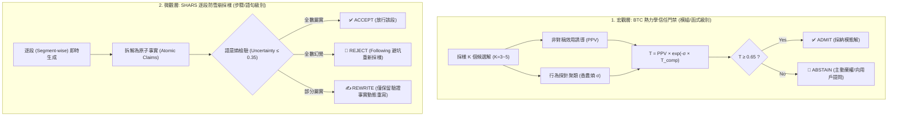

# 🧠 Trust Governor — 熱力學行為信任與 SHARS 逐段防雪崩治理層

> **核心理念**：從主觀猜測升級為**「宏觀熱力學信度 ＋ 微觀逐段防雪崩拒絕採樣」**。
> 結合 **Behavioral Trust Clustering (BTC)** 與 Oxford/OATML **SHARS (ICML 2026)** 原理，在推論期主動篩除發散解，並對半真半假之片段執行**「原子事實動態重寫」**，徹底杜絕幻覺滾雪球（Hallucination Snowballing）。

---

## 🎯 When to Use

- 實作高難度或邊界複雜的核心演算法（加解密、金融計算、複雜資料庫交易、複雜正則）
- 長文本與多步驟架構規劃（防止前期微小錯誤在後續步驟滾雪球）
- 落地 Karpathy 護欄 #4「困惑即停 (Stop When Confused)」的數學量化依據
- 在 `/review`、`Auditor` 或 `Critic` 審查階段對關鍵程式碼進行行為等價探針測試

---

## 🔬 雙軌防禦體系 (Dual-Granularity Defense)



---

## 🛠️ SHARS 原子事實動態重寫協議 (Dynamic Rewriting)

當 Critic 或 Auditor 發現一段代碼或規劃中存在「部分真實、部分幻覺」時，系統會自動產出重寫約束：

```text
Original statement had factual inaccuracies.
VERIFIED TRUTHS (Must Keep):
- 驗證屬實的 API 呼叫 / 型別定義 A
- 驗證屬實的商業邏輯 B

REJECTED CLAIMS (Must Omit):
- 幻覺出的不存在函式庫 C
- 錯誤的參數假設 D

Task: Rewrite the segment incorporating ONLY verified truths.
```

---

## 💻 內建 Python 腳本調用 (`skills/trust-governor/scripts/governor.py`)

本模組提供零外部依賴的純 Python 標準庫實作，可直接在 Agent 內部調用：

### 1. 宏觀 BTC 候選解評估
```python
from governor import evaluate_candidates, Decision

candidates = ["def f(n): return n * 2", "def f(n): return n + n", "def f(n): return 2 * n"]
confidences = [0.95, 0.90, 0.92]
probe_runner = lambda code: (20, 40)

res = evaluate_candidates(candidates, confidences, probe_runner, threshold=0.65)
if res.action == Decision.ADMIT:
    print(f"✅ 通過熱力學門禁: Trust={res.trust}, 採用: {res.modal_answer}")
```

### 2. 微觀 SHARS 逐段驗證與重寫
```python
from governor import evaluate_segment, SegmentAction

segment = "Lin is an AI researcher who won the 1990 Nobel Prize in Chemistry."
claims = ["Lin is an AI researcher", "Lin won 1990 Nobel Prize in Chemistry"]

def verifier(claim):
    if "Nobel" in claim:
        return False, 0.95  # 幻覺
    return True, 0.05       # 屬實

res = evaluate_segment(segment, claims, verifier, uncertainty_threshold=0.35)
if res.action == SegmentAction.REWRITE:
    print("✍️ 觸發動態重寫！提示詞：\n", res.rewrite_prompt)
```
