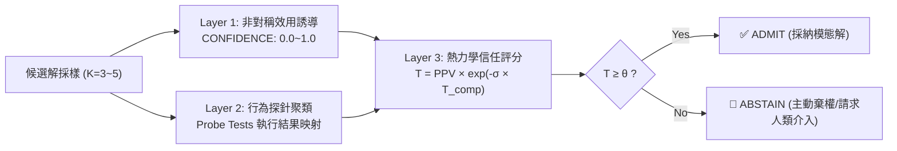

# 🧠 Trust Governor — 熱力學行為信任與防幻覺治理層

> **核心理念**：從主觀猜測升級為**「熱力學行為信任計量」**。LLM 容易自信盲猜，本模組透過「非對稱效用信度 ＋ 行為探針聚類 ＋ 香農熵熱力學公式」，在推論期主動篩除發散與幻覺代碼，大幅提升生產環境的淨精度（Net Precision > 92%）。

---

## 🎯 When to Use

- 實作高難度或邊界複雜的核心演算法（如複雜資料結構、加解密、金融計算、複雜正則）
- 落地 Karpathy 護欄 #4「困惑即停 (Stop When Confused)」的數學量化依據
- 在 `/review`、`Auditor` 或 `Critic` 審查階段對關鍵函式進行行為等價探針測試
- 需要主動棄權（Abstain）機制，避免模型「一本正經胡說八道」

---

## 🔬 核心公式與熱力學相圖 (Thermodynamic Formula)

$$T = \text{PPV} \cdot \exp(-\sigma_{\text{calib}} \cdot T_{\text{comp}})$$

* **$\text{PPV}$ (Positive Predictive Value)**：候選群體的平均回報信度。
* **$\sigma_{\text{calib}}$**：行為聚類的**正規化香農熵（Shannon Entropy $\in [0, 1]$）**。
  - 當所有候選解的探針執行結果一致時：$\sigma_{\text{calib}} = 0 \implies T = \text{PPV}$
  - 當候選解輸出混亂發散時：$\sigma_{\text{calib}} \to 1 \implies T \to 0$（信任度雪崩）
* **$T_{\text{comp}}$**：計算溫度（自適應補償參數）。
* **$\theta$ (Decision Threshold)**：
  - **$\theta = 0.65$** (推薦預設)：保守高精度模式，HumanEval 幻覺率降低 52%，淨精度達 92.2%。
  - **$\theta = 0.50$**：平衡模式，兼顧覆蓋率與精確度。

---

## 🛠️ 三層運作流程 (The 3-Layer Pipeline)



---

## 📋 系統提示詞範本 (Asymmetric Utility Prompt)

在要求模型生成關鍵或高風險代碼時，附加以下約束以誘導真實信度：

```text
你是一個具備校準自我意識的專家級 AI。
針對當前的關鍵實作：
1. 給出最精簡且正確的程式碼。
2. 評估自我把握度，並在最後一行輸出：
   CONFIDENCE: <0.0 到 1.0 之間的數值>
3. 效用規則：答對 +1 分，答錯倒扣 -3 分，主動承認不確定 0 分。
   若把握度不足 75%，請直接輸出：I_DO_NOT_KNOW 並給予 CONFIDENCE: 0.0。
```

---

## 💻 內建 Python 腳本調用 (`skills/trust-governor/scripts/governor.py`)

本模組提供零外部依賴的純 Python 標準庫實作，可直接在 Agent 內部或 CI/CD 門禁中調用：

```python
from governor import evaluate_candidates, Decision

# 1. 準備 K 個候選代碼與各自的自信度
candidates = [
    "def solve(n): return n * 2",
    "def solve(n): return n + n",
    "def solve(n): return 2 * n"
]
confidences = [0.95, 0.90, 0.92]

# 2. 定義行為探針執行器 (以輸入 10, 20 的執行結果為 key)
probe_runner = lambda code: (20, 40) # 實際場景透過 subprocess 沙盒執行

# 3. 進行熱力學行為聚類評估
result = evaluate_candidates(candidates, confidences, probe_runner, threshold=0.65)

if result.action == Decision.ADMIT:
    print(f"✅ 通過熱力學門禁！信任度: {result.trust} (熵值: {result.sigma_calib})")
    print(f"採用模態解答: {result.modal_answer}")
else:
    print(f"🛑 觸發主動棄權 (ABSTAIN)！信任度不足: {result.trust} < 0.65")
```
